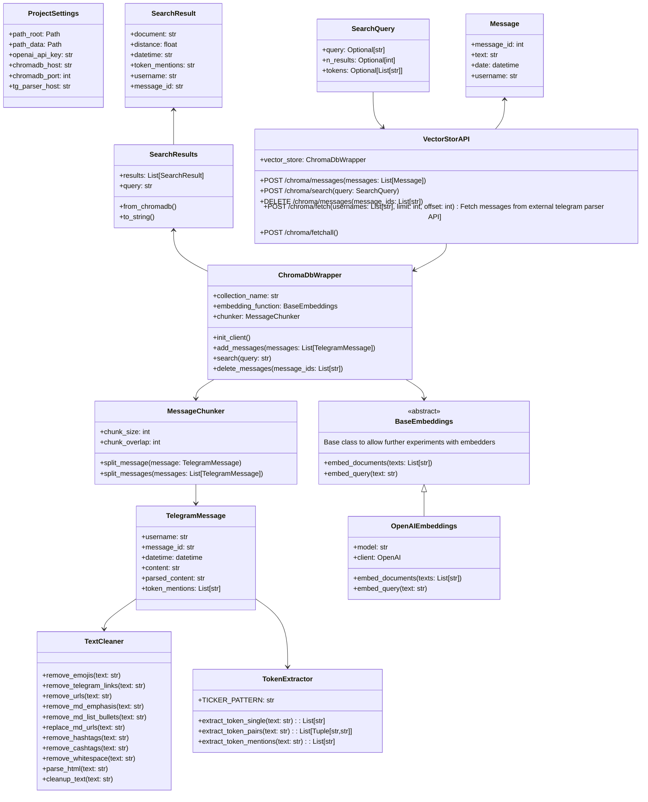

# Web3 Assistant ChromaDB Service
Provides api for ChromaDB vector storage.
- Accepts telegram messages
- Processes them
- Vectorizes with OpenAI embeddings and stores in ChromaDB
- Provides a search API for inserted messages

To launch with other services, make sure you added `web3-assistant-network` network to all the compose files and initialized the network with `docker network create web3-assistant-network`

## Endpoints
Swagger: http://localhost:6400/docs

### Models

```python
class Message(BaseModel):
    message_id: int
    text: str
    date: datetime
    username: str

class SearchQuery(BaseModel):
    query: str
    n_results: Optional[int] = 15

class SearchResult(BaseModel):
    document: str
    distance: float
    datetime: datetime
    token_mentions: str
    channel: str
    message_id: str
    chunk_id: str

class SearchResults(BaseModel):
    results: List[SearchResult]
```

### Endpoints
#### POST `/chroma/messages`
Add messages to vector storage.
- **Input**: `List[Message]`
- **Returns**: `Dict[str, str]`
```json
{
    "status": "success",
    "message": "Added N messages"
}
```

#### POST `/chroma/search`
Semantic search across messages.
- **Input**: `SearchQuery`
- **Returns**: `SearchResults`
- **Example Response**:
```json
{
  "results": [
    {
      "document": "Test message\nThis is test message to add to database",
      "distance": 0.19344091,
      "datetime": "2025-04-15T10:57:15+00:00",
      "token_mentions": "",
      "channel": "test",
      "message_id": "0",
      "chunk_id": "test__0__chunk-0"
    }
  ]
}
```

#### DELETE `/chroma/messages`
Delete messages from storage.
- **Input**: `List[str]` (message IDs)
- **Returns**: `Dict[str, str]`
```json
{
    "status": "success",
    "message": "Deleted N messages"
}
```

#### POST `/chroma/fetch`
Fetch and store messages from telegram parser.
- **Input Parameters**:
  - `usernames: List[str]`
  - `limit: int = 50`
  - `offset: int = 0`
- **Returns**: `Dict[str, str]`
```json
{
    "status": "success",
    "message": "Added N messages"
}
```

## CLI Tools
- Test chunking: `python -m src.vector_storage.chunking --help`
- Test parsing from html files: `python -m src.io.parse_tg_html --help`
- Add messages to Vector Storage from html files `python -m src.vector_storage.vector_storage --help`

Put htmls in `./data/html/`

## Code Diagram

